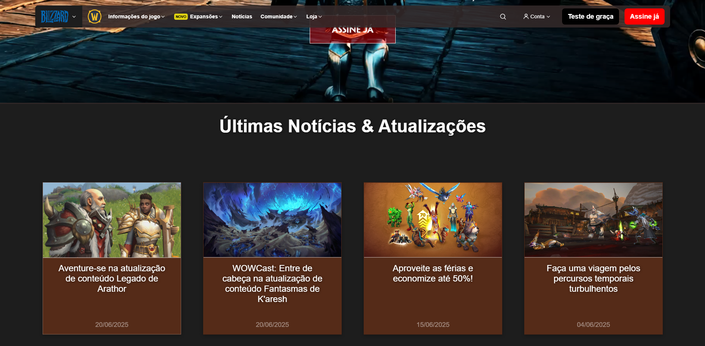
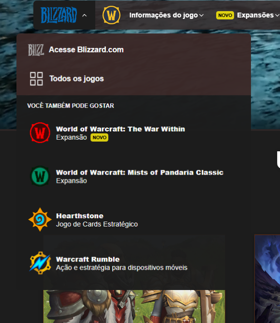

<h1 align="center">WOW Project</h1>

###

Remaking World of Warcraft site in order to study

###

<h2 align="left">Current Progress</h2>

###

  

###

  

###

<h2 align="left">I coded with</h2>

###

  
  
  
  
  
  
  
  
  

###

###
